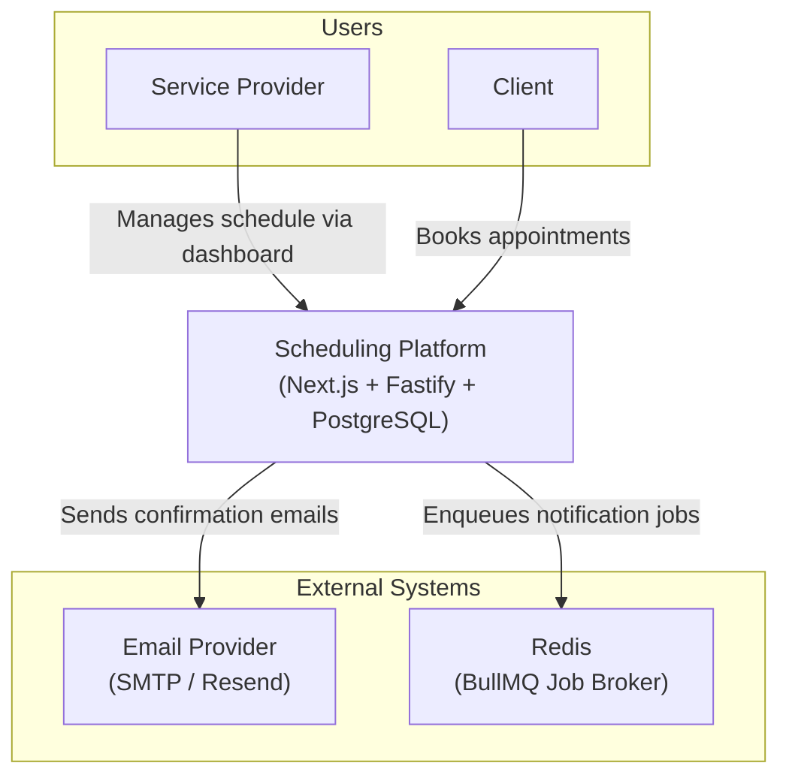
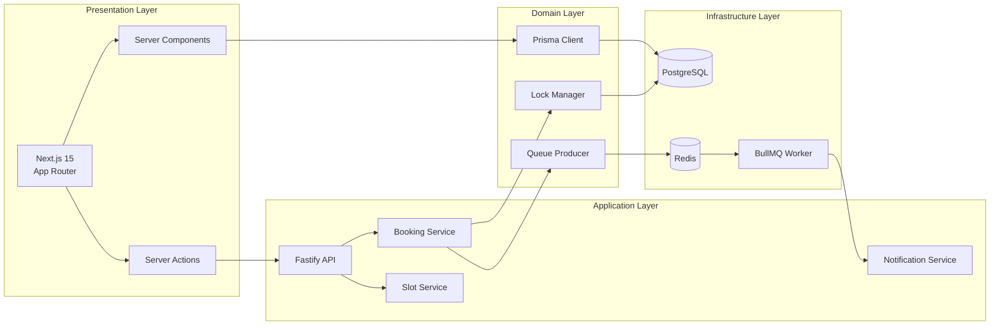
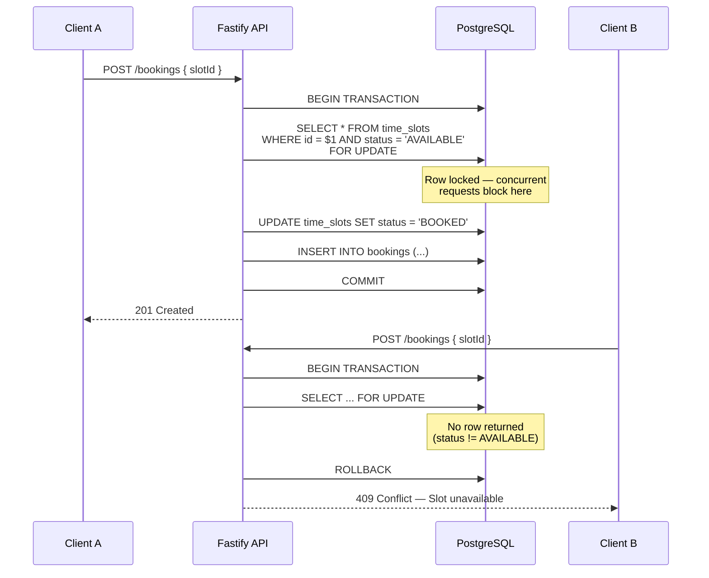
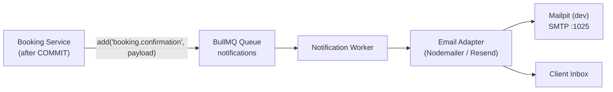
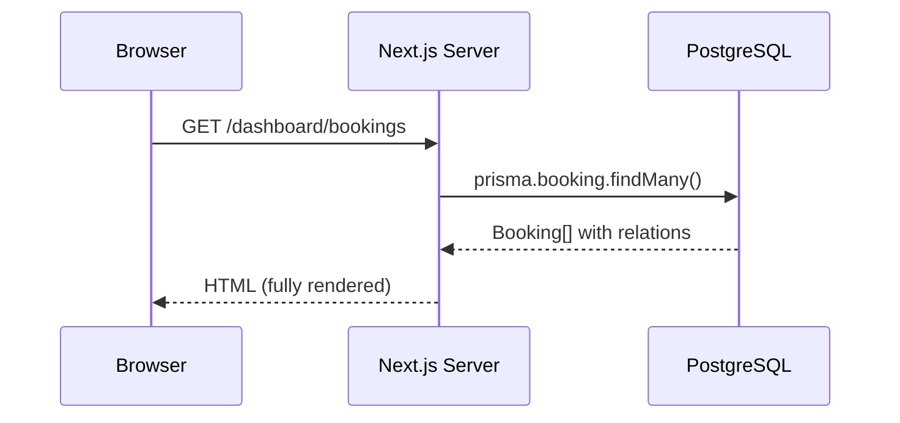
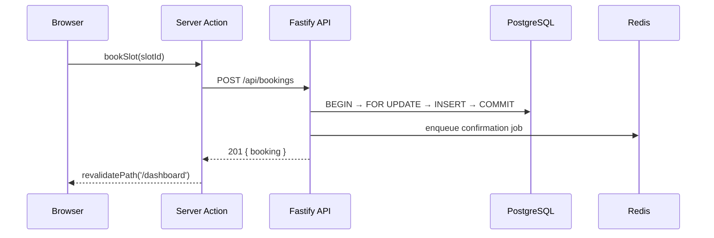
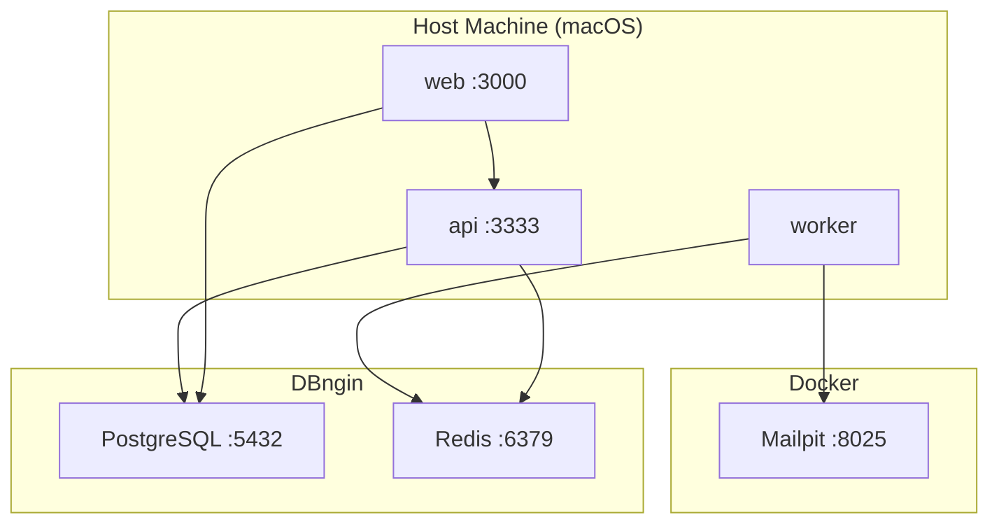
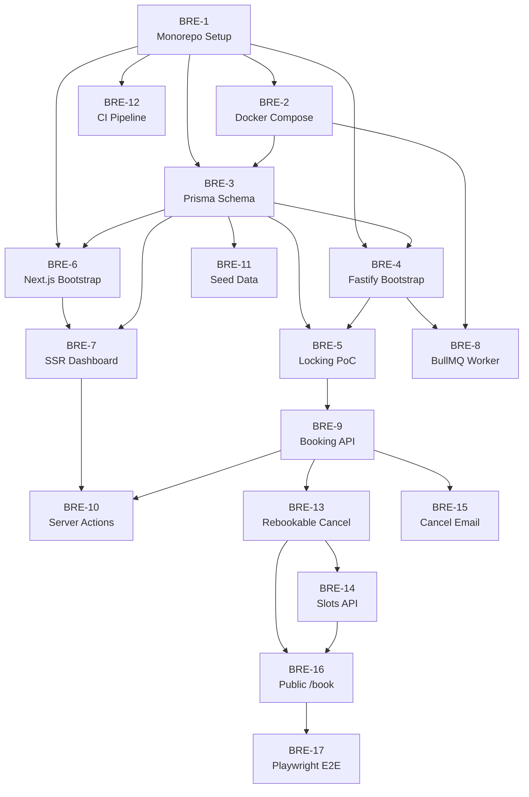

# Architecture — Real-Time Scheduling Platform

This document describes the system architecture, data model, concurrency strategy, and messaging pipeline for the **Real-Time Scheduling Platform** project.

---

## Table of Contents

1. [System Context](#1-system-context)
2. [High-Level Architecture](#2-high-level-architecture)
3. [Component Design](#3-component-design)
4. [Data Model](#4-data-model)
5. [Concurrency & Locking Strategy](#5-concurrency--locking-strategy)
6. [Notification Pipeline](#6-notification-pipeline)
7. [Request Flows](#7-request-flows)
8. [Deployment Topology](#8-deployment-topology)
9. [Cross-Cutting Concerns](#9-cross-cutting-concerns)
10. [Initial Linear Issues](#10-initial-linear-issues)

---

## 1. System Context



### Actors

| Actor                | Role                                                                       |
| -------------------- | -------------------------------------------------------------------------- |
| **Service Provider** | Creates services, defines availability windows, views and manages bookings |
| **Client**           | Browses available slots and creates bookings                               |
| **System (Worker)**  | Processes queued jobs (email dispatch, future: SMS, webhooks)              |

---

## 2. High-Level Architecture

The system follows a **modular monorepo** pattern with clear separation between presentation (Next.js), application (Fastify), and data (PostgreSQL + Redis) layers.



### Design Principles

1. **Database as source of truth** — Availability state lives in PostgreSQL, not in-memory caches.
2. **Pessimistic locking for writes** — Booking mutations acquire locks before checking availability.
3. **Async side effects** — Email dispatch is fire-and-forqueue; the API responds after the transaction commits.
4. **SSR-first reads** — Dashboard data is fetched server-side to minimize client bundle and eliminate waterfalls.
5. **Type safety end-to-end** — Shared Zod schemas and Prisma-generated types propagate from DB to UI.

---

## 3. Component Design

### 3.1 Frontend — `apps/web`

| Module                | Responsibility                                        |
| --------------------- | ----------------------------------------------------- |
| `app/(dashboard)/`    | Protected dashboard routes (Server Components)        |
| `app/(public)/book/`  | Public booking flow                                   |
| `components/ui/`      | shadcn/ui primitives (Button, Calendar, Dialog, etc.) |
| `components/booking/` | Domain-specific components (SlotGrid, BookingForm)    |
| `lib/actions/`        | Server Actions wrapping API calls                     |
| `lib/db.ts`           | Prisma client singleton for Server Component reads    |

**SSR Pattern:**

```typescript
// app/(dashboard)/bookings/page.tsx — Server Component
export default async function BookingsPage() {
  const bookings = await prisma.booking.findMany({
    include: { slot: true, client: true },
    orderBy: { createdAt: "desc" },
  });
  return <BookingTable data={bookings} />;
}
```

Server Components read directly from PostgreSQL. Mutations go through Server Actions → Fastify API to keep write logic centralized and transactional.

### 3.2 Backend — `apps/api`

| Module                           | Responsibility                                    |
| -------------------------------- | ------------------------------------------------- |
| `routes/health.ts`               | Health check endpoint                             |
| `routes/bookings.ts`             | Booking CRUD + concurrency-safe create            |
| `routes/slots.ts`                | Slot availability management                      |
| `services/booking.service.ts`    | Transaction orchestration                         |
| `services/lock.service.ts`       | PostgreSQL lock acquisition                       |
| `queues/notification.queue.ts`   | BullMQ producer                                   |
| `workers/notification.worker.ts` | BullMQ consumer (separate process)                |
| `plugins/prisma.ts`              | Fastify plugin decorating `request.server.prisma` |

**Fastify Plugin Structure:**

```
apps/api/src/
├── app.ts              # Fastify instance factory
├── server.ts           # Entry point (HTTP)
├── worker.ts           # Entry point (BullMQ worker)
├── plugins/
│   ├── prisma.ts
│   └── redis.ts
├── routes/
├── services/
└── queues/
```

### 3.3 Shared Packages

| Package          | Contents                                                      |
| ---------------- | ------------------------------------------------------------- |
| `@repo/database` | Prisma schema, migrations, generated client, seed script      |
| `@repo/shared`   | Zod validators, TypeScript interfaces, constants, error codes |

---

## 4. Data Model

```mermaid
erDiagram
    User ||--o{ Service : owns
    Service ||--o{ TimeSlot : has
    TimeSlot ||--o| Booking : "booked by"
    User ||--o{ Booking : "made by (client)"
    Booking ||--o| NotificationJob : triggers

    User {
        uuid id PK
        string email UK
        string name
        enum role "PROVIDER | CLIENT | ADMIN"
        timestamp created_at
        timestamp updated_at
    }

    Service {
        uuid id PK
        uuid provider_id FK
        string name
        string description
        int duration_minutes
        timestamp created_at
    }

    TimeSlot {
        uuid id PK
        uuid service_id FK
        timestamp starts_at
        timestamp ends_at
        enum status "AVAILABLE | BOOKED | BLOCKED"
        timestamp created_at
        timestamp updated_at
    }

    Booking {
        uuid id PK
        uuid slot_id FK UK
        uuid client_id FK
        enum status "CONFIRMED | CANCELLED | COMPLETED"
        timestamp booked_at
        timestamp cancelled_at
    }

    NotificationJob {
        uuid id PK
        uuid booking_id FK
        enum type "CONFIRMATION | REMINDER | CANCELLATION"
        enum status "PENDING | SENT | FAILED"
        json payload
        timestamp created_at
        timestamp sent_at
    }
```

### Key Constraints

- `TimeSlot.status` transitions: `AVAILABLE → BOOKED` (one direction under lock).
- `Booking.slot_id` is **unique** — one booking per slot, enforced at DB level.
- Composite index on `(service_id, starts_at)` for fast availability queries.
- Partial index on `TimeSlot WHERE status = 'AVAILABLE'` for dashboard queries.

---

## 5. Concurrency & Locking Strategy

### Problem

Two clients selecting the same slot at `T₀` must result in exactly one successful booking. A naive read-check-write pattern fails under concurrent requests:

```
Client A: READ slot (available) ────────────────── WRITE (book) ✓
Client B: READ slot (available) ── WRITE (book) ✗  (should fail)
```

### Solution: Pessimistic Row-Level Locking



### Implementation (Prisma + Raw SQL)

Prisma does not expose `FOR UPDATE` natively in all query paths. The lock service uses `$queryRaw` inside `$transaction`:

```typescript
async function acquireSlotLock(tx: PrismaTransaction, slotId: string) {
  const [slot] = await tx.$queryRaw<TimeSlot[]>`
    SELECT id, status, starts_at, ends_at
    FROM time_slots
    WHERE id = ${slotId}::uuid
      AND status = 'AVAILABLE'
    FOR UPDATE
  `;
  if (!slot) throw new SlotUnavailableError(slotId);
  return slot;
}
```

### Advisory Locks (Alternative / Complement)

For operations spanning multiple slots (e.g., blocking a time range), PostgreSQL advisory locks provide session-level mutual exclusion:

```sql
SELECT pg_advisory_xact_lock(hashtext('slot-range:' || service_id || ':' || date));
```

Advisory locks are automatically released at transaction end (`xact` scope).

### Lock Strategy Decision Matrix

| Scenario             | Strategy                       | Reason                              |
| -------------------- | ------------------------------ | ----------------------------------- |
| Single slot booking  | `SELECT … FOR UPDATE`          | Row-level, minimal contention scope |
| Bulk slot generation | Advisory lock per service+date | Prevents duplicate slot creation    |
| Dashboard reads      | No lock (Read Committed)       | Stale reads acceptable for display  |
| Booking cancellation | `FOR UPDATE` on booking row    | Prevents double-cancel              |

---

## 6. Notification Pipeline



### Job Schema

```typescript
interface BookingConfirmationJob {
  bookingId: string;
  clientEmail: string;
  clientName: string;
  slotStartsAt: string; // ISO 8601
  serviceName: string;
}
```

### Reliability Features

| Feature               | Configuration                                                                             |
| --------------------- | ----------------------------------------------------------------------------------------- |
| **Retries**           | 3 attempts with exponential backoff (1s, 4s, 16s)                                         |
| **Dead Letter Queue** | Failed jobs after max retries → `notifications-dlq` (BullMQ 6 forbids `:` in queue names) |
| **Idempotency**       | Job ID = `booking:{bookingId}:confirmation` prevents duplicates                           |
| **Observability**     | BullMQ Board (dev) or BullMQ Pro metrics (prod)                                           |

### Why Not Inline Email?

Sending email synchronously adds 500ms–2s latency per request and couples API availability to SMTP reliability. Queuing decouples the critical path (booking) from the side effect (notification).

---

## 7. Request Flows

### 7.1 Dashboard Load (SSR)



No client-side JavaScript required for initial data load.

### 7.2 Create Booking (Write Path)



### 7.3 Concurrent Booking Attempt

See [Section 5 — Concurrency & Locking Strategy](#5-concurrency--locking-strategy).

---

## 8. Deployment Topology

### Local Development (DBngin + Docker)

The default local setup runs **PostgreSQL and Redis via [DBngin](https://dbngin.com/)** (native macOS services) and **Mailpit via Docker** (email capture only). Application processes run directly on the host with Node.js.



> **Alternative:** A full Docker Compose profile (PostgreSQL + Redis + Mailpit) remains available for contributors who prefer an all-container workflow and for CI integration tests.

### Production (Target)

| Component  | Platform              | Notes                                        |
| ---------- | --------------------- | -------------------------------------------- |
| Web        | Vercel / Fly.io       | Next.js standalone output                    |
| API        | Fly.io / Railway      | Fastify with health checks                   |
| Worker     | Fly.io / Railway      | Separate process, same codebase              |
| PostgreSQL | Neon / Supabase / RDS | Managed, with connection pooling (PgBouncer) |
| Redis      | Upstash / ElastiCache | BullMQ-compatible                            |

---

## 9. Cross-Cutting Concerns

### Error Handling

| HTTP Status | Scenario                                        |
| ----------- | ----------------------------------------------- |
| `201`       | Booking created successfully                    |
| `409`       | Slot no longer available (concurrency conflict) |
| `404`       | Slot or booking not found                       |
| `422`       | Validation error (Zod)                          |
| `500`       | Unexpected server error                         |

All API errors follow a consistent envelope:

```json
{
  "error": {
    "code": "SLOT_UNAVAILABLE",
    "message": "The selected time slot is no longer available.",
    "details": { "slotId": "uuid" }
  }
}
```

### Validation

- **API layer:** Zod schemas from `@repo/shared`, validated via Fastify preHandler hooks.
- **Database layer:** Prisma schema constraints (unique, not null, enums).
- **Frontend layer:** React Hook Form + Zod resolver for client-side UX (server validates regardless).

### Testing Strategy

| Level       | Tool                    | Focus                                       |
| ----------- | ----------------------- | ------------------------------------------- |
| Unit        | Vitest                  | Services, lock logic, validators            |
| Integration | Vitest + Testcontainers | API routes with real PostgreSQL             |
| Concurrency | Custom script           | Parallel booking attempts against same slot |
| E2E         | Playwright              | Full booking flow through UI                |

### Security (Future Phases)

- JWT-based authentication (Fastify `@fastify/jwt`)
- Role-based access control (Provider vs Client)
- Rate limiting on booking endpoint (`@fastify/rate-limit`)
- CORS restricted to web origin

---

## 10. Initial Linear Issues

The following Issues live in the Linear project **[Real-Time Scheduling Platform](https://linear.app/breno-nery/project/real-time-scheduling-platform-8335a3f3ee49)**. Development is organized into **Milestones (phases)** to track progress across the roadmap.

> **Note on numbering:** The Linear team already had prior issues, so live identifiers start at **BRE-33**. The `BRE-1 … BRE-12` labels below are documentation references; the mapping to live Linear IDs is in the phase table.

### Development Phases (Milestones)

| Milestone                                   | Target     | Issues (Linear ID)                        | Goal                                                          |
| ------------------------------------------- | ---------- | ----------------------------------------- | ------------------------------------------------------------- |
| **Phase 1 — Foundation & Data**             | 2026-07-26 | BRE-33, BRE-34, BRE-35, BRE-44            | Monorepo, infra, Prisma schema, seed data                     |
| **Phase 2 — Backend Core & Concurrency**    | 2026-08-09 | BRE-36, BRE-37, BRE-41                    | Fastify API, locking PoC, booking CRUD                        |
| **Phase 3 — Frontend & SSR Dashboard**      | 2026-08-23 | BRE-38, BRE-40, BRE-43                    | Next.js, SSR dashboard, Server Actions                        |
| **Phase 4 — Notifications & Delivery**      | 2026-09-06 | BRE-45, BRE-42                            | BullMQ email worker, CI pipeline                              |
| **Phase 5 — Availability & Public Booking** | 2026-09-20 | BRE-76, BRE-77, BRE-78, BRE-79, BRE-80    | Rebookable cancel, slots API, public `/book`, cancel email, E2E |

### Doc → Linear ID Mapping

| Doc ref | Linear ID | Milestone |
| ------- | --------- | --------- |
| BRE-1   | BRE-33    | Phase 1   |
| BRE-2   | BRE-34    | Phase 1   |
| BRE-3   | BRE-35    | Phase 1   |
| BRE-4   | BRE-36    | Phase 2   |
| BRE-5   | BRE-37    | Phase 2   |
| BRE-6   | BRE-38    | Phase 3   |
| BRE-7   | BRE-40    | Phase 3   |
| BRE-8   | BRE-45    | Phase 4   |
| BRE-9   | BRE-41    | Phase 2   |
| BRE-10  | BRE-43    | Phase 3   |
| BRE-11  | BRE-44    | Phase 1   |
| BRE-12  | BRE-42    | Phase 4   |
| BRE-13  | BRE-76    | Phase 5   |
| BRE-14  | BRE-77    | Phase 5   |
| BRE-15  | BRE-78    | Phase 5   |
| BRE-16  | BRE-79    | Phase 5   |
| BRE-17  | BRE-80    | Phase 5   |

---

### BRE-1 · `[DevOps]` Monorepo scaffolding & tooling setup

**Priority:** Urgent  
**Estimate:** 3 points

**Description:**  
Initialize the monorepo structure with npm workspaces, TypeScript project references, ESLint, Prettier, and shared tsconfig. Create the `apps/web`, `apps/api`, `packages/database`, and `packages/shared` directories with minimal boilerplate.

**Acceptance Criteria:**

- [ ] Root `package.json` with npm workspace configuration
- [ ] Shared `tsconfig.base.json` extended by all packages
- [ ] ESLint + Prettier configured at root with consistent rules
- [ ] Each package has its own `package.json`, `tsconfig.json`, and builds independently
- [ ] `npm install` succeeds with zero errors
- [ ] README "How to Run" prerequisites are satisfied

---

### BRE-2 · `[DevOps]` Docker Compose infrastructure

**Priority:** Urgent  
**Estimate:** 2 points  
**Blocked by:** BRE-1

**Description:**  
Create `docker/docker-compose.yml` with **Mailpit** as the default service. PostgreSQL and Redis are expected to run locally via **DBngin**; document their connection strings in `.env.example`. Include an optional Docker Compose profile (`full`) for contributors who prefer containerized PostgreSQL and Redis.

**Acceptance Criteria:**

- [ ] `docker compose up -d mailpit` starts Mailpit successfully
- [ ] Mailpit UI accessible at `http://localhost:8025`, SMTP at `localhost:1025`
- [ ] `.env.example` documents DBngin defaults (`DATABASE_URL`, `REDIS_URL`) and Mailpit SMTP settings
- [ ] Optional `full` profile starts PostgreSQL and Redis containers for CI/alternative setups
- [ ] README documents DBngin as the primary local workflow

---

### BRE-3 · `[Database]` Prisma schema & initial migration

**Priority:** Urgent  
**Estimate:** 3 points  
**Blocked by:** BRE-1, BRE-2

**Description:**  
Define the Prisma schema for User, Service, TimeSlot, Booking, and NotificationJob entities. Generate and apply the initial migration. Export the Prisma client from `@repo/database`.

**Acceptance Criteria:**

- [ ] Prisma schema matches the ER diagram in this document
- [ ] Unique constraint on `Booking.slot_id`
- [ ] Composite index on `(service_id, starts_at)` for TimeSlot
- [ ] `npm run db:migrate --workspace=@repo/database` applies migration successfully against DBngin PostgreSQL
- [ ] Prisma client importable from `@repo/database`

---

### BRE-4 · `[Backend]` Fastify API bootstrap & health check

**Priority:** High  
**Estimate:** 2 points  
**Blocked by:** BRE-1, BRE-3

**Description:**  
Bootstrap the Fastify application with TypeScript, Prisma plugin, structured logging (pino), and a `/health` endpoint that verifies PostgreSQL connectivity.

**Acceptance Criteria:**

- [ ] Fastify starts on port 3333 via `npm run dev --workspace=@repo/api`
- [ ] `GET /health` returns `{ status: "ok", db: "connected" }`
- [ ] Prisma client available via Fastify decoration
- [ ] Graceful shutdown on SIGTERM

---

### BRE-5 · `[Backend]` PostgreSQL locking proof-of-concept

**Priority:** High  
**Estimate:** 5 points  
**Blocked by:** BRE-3, BRE-4

**Description:**  
Implement the `LockService` with `SELECT … FOR UPDATE` inside a Prisma transaction. Write an integration test that fires N concurrent booking requests against a single slot and asserts exactly one succeeds.

**Acceptance Criteria:**

- [ ] `LockService.acquireSlotLock()` uses `$queryRaw` with `FOR UPDATE`
- [ ] Booking creation wrapped in `$transaction`
- [ ] Concurrent test (≥10 parallel requests) passes: 1 success, N-1 conflicts (409)
- [ ] Transaction rolls back cleanly on conflict

---

### BRE-6 · `[Frontend]` Next.js App Router bootstrap

**Priority:** High  
**Estimate:** 3 points  
**Blocked by:** BRE-1

**Description:**  
Initialize the Next.js 15 application with App Router, TailwindCSS, and shadcn/ui. Configure the Prisma client for Server Component usage. Create a root layout and placeholder dashboard route.

**Acceptance Criteria:**

- [ ] Next.js dev server starts on port 3000
- [ ] TailwindCSS and shadcn/ui configured with a base theme
- [ ] Prisma client singleton in `lib/db.ts` for Server Components
- [ ] Placeholder `/dashboard` route renders

---

### BRE-7 · `[Frontend]` Booking dashboard (SSR)

**Priority:** High  
**Estimate:** 5 points  
**Blocked by:** BRE-3, BRE-6

**Description:**  
Build the booking management dashboard using Server Components. Display a table of bookings with slot time, client name, service, and status. Data must be fetched server-side via Prisma — no client-side fetch on initial load.

**Acceptance Criteria:**

- [ ] `/dashboard/bookings` renders booking data via Server Component
- [ ] Table shows: service name, slot time, client name, status, booked at
- [ ] Empty state when no bookings exist
- [ ] Page source contains rendered HTML (SSR verified)
- [ ] Uses shadcn/ui Table component

---

### BRE-8 · `[Backend]` BullMQ queue & email worker

**Priority:** Medium  
**Estimate:** 5 points  
**Blocked by:** BRE-2, BRE-4

**Description:**  
Set up BullMQ with Redis. Create a `notifications` queue, a worker process, and an email adapter using Nodemailer pointed at Mailpit (dev). Implement the booking confirmation job with retries and idempotency.

**Acceptance Criteria:**

- [ ] `NotificationQueue` enqueues jobs after successful booking
- [ ] Worker process runs independently via `npm run worker:dev --workspace=@repo/api`
- [ ] Confirmation email appears in Mailpit inbox
- [ ] 3 retries with exponential backoff configured
- [ ] Job ID prevents duplicate emails for same booking

---

### BRE-9 · `[Backend]` Booking API endpoints (CRUD)

**Priority:** Medium  
**Estimate:** 5 points  
**Blocked by:** BRE-5

**Description:**  
Implement REST endpoints: `POST /bookings` (create with lock), `GET /bookings` (list), `GET /bookings/:id`, `DELETE /bookings/:id` (cancel). All endpoints validated with Zod schemas from `@repo/shared`.

**Acceptance Criteria:**

- [ ] All endpoints return consistent error envelope
- [ ] `POST /bookings` uses LockService and enqueues notification
- [ ] `DELETE /bookings/:id` sets status to CANCELLED and frees the slot
- [ ] Zod validation on all request bodies and params
- [ ] Integration tests for happy path and conflict path

---

### BRE-10 · `[Frontend]` Server Actions integration

**Priority:** Medium  
**Estimate:** 3 points  
**Blocked by:** BRE-7, BRE-9

**Description:**  
Create Server Actions for booking creation and cancellation that call the Fastify API. Use `revalidatePath` to refresh the SSR dashboard after mutations.

**Acceptance Criteria:**

- [ ] `bookSlot(slotId)` Server Action calls `POST /api/bookings`
- [ ] `cancelBooking(bookingId)` Server Action calls `DELETE /api/bookings/:id`
- [ ] Dashboard revalidates after successful mutation
- [ ] Error states displayed to user via toast (shadcn/ui Sonner)

---

### BRE-11 · `[Database]` Seed data & demo scenarios

**Priority:** Low  
**Estimate:** 2 points  
**Blocked by:** BRE-3

**Description:**  
Create a seed script that populates the database with a demo provider, two services, 20+ time slots, and sample bookings for dashboard development and demos.

**Acceptance Criteria:**

- [ ] `npm run db:seed --workspace=@repo/database` populates demo data without errors
- [ ] At least 1 provider, 2 services, 20 slots (mix of AVAILABLE and BOOKED)
- [ ] Seed is idempotent (safe to run multiple times)

---

### BRE-12 · `[DevOps]` CI pipeline (lint, test, build)

**Priority:** Low  
**Estimate:** 3 points  
**Blocked by:** BRE-1

**Description:**  
Configure GitHub Actions workflow that runs lint, type-check, unit tests, and build on every push and pull request. Use Docker services for PostgreSQL and Redis in integration test job.

**Acceptance Criteria:**

- [ ] Workflow triggers on push to `main` and on PRs
- [ ] Jobs: lint, type-check, test (unit), test (integration with Testcontainers)
- [ ] Build succeeds for both `apps/web` and `apps/api`
- [ ] Status badge added to README

---

### BRE-13 · `[Database]` Rebookable slot cancellations

**Priority:** Urgent  
**Estimate:** 3 points  
**Linear:** [BRE-76](https://linear.app/breno-nery/issue/BRE-76/database-rebookable-slot-cancellations)

**Description:**  
Cancel currently marks `TimeSlot.status = AVAILABLE` but the cancelled `Booking` row still occupies `slot_id`. The unique constraint then rejects a new booking. Restore the documented contract: cancelling a booking frees the slot for a new booking.

**Acceptance Criteria:**

- [ ] At most one non-cancelled booking exists per slot (partial unique index or equivalent)
- [ ] `DELETE /bookings/:id` still soft-cancels (status `CANCELLED`, `cancelledAt` set, slot `AVAILABLE`)
- [ ] After cancel, `POST /bookings` on the same slot succeeds for a new client
- [ ] Integration tests cover cancel-then-rebook and still prevent two `CONFIRMED` bookings on one slot
- [ ] Dashboard no longer needs the `booking: { is: null }` workaround for `AVAILABLE` slots
- [ ] Existing seed and historical `CANCELLED` rows migrate cleanly

---

### BRE-14 · `[Backend]` Slot availability API & advisory locks

**Priority:** High  
**Estimate:** 5 points  
**Blocked by:** BRE-13  
**Linear:** [BRE-77](https://linear.app/breno-nery/issue/BRE-77/backend-slot-availability-api-and-advisory-locks)

**Description:**  
Implement `routes/slots.ts` and advisory locks for bulk slot generation so the public booking flow can list and generate availability without duplicating slots under concurrency.

**Acceptance Criteria:**

- [ ] `GET /slots` lists slots with Zod-validated filters (`serviceId`, date range, `status`)
- [ ] `POST /slots/generate` creates slots for a day or range and uses `pg_advisory_xact_lock` keyed by service + date
- [ ] Concurrent generate requests do not create duplicate overlapping slots
- [ ] Blocking a slot (`BLOCKED`) is supported; booking remains the only path to `BOOKED`
- [ ] Shared Zod schemas live in `@repo/shared`; errors use the existing envelope
- [ ] Integration tests for list, generate, duplicate prevention, and advisory-lock concurrency

---

### BRE-15 · `[Backend]` Cancellation notification jobs

**Priority:** Medium  
**Estimate:** 3 points  
**Linear:** [BRE-78](https://linear.app/breno-nery/issue/BRE-78/backend-cancellation-notification-jobs)

**Description:**  
`NotificationType` already includes `CANCELLATION`, but `cancelBooking` does not enqueue a job. Mirror the confirmation pipeline: persist a `NotificationJob`, enqueue BullMQ after COMMIT, and send email via the existing adapter.

**Acceptance Criteria:**

- [ ] Successful cancel enqueues `booking.cancellation` with an idempotent job ID
- [ ] Worker sends a cancellation email (Mailpit in dev)
- [ ] Queue/SMTP failures do not fail the cancel HTTP response
- [ ] Retries and DLQ match the confirmation worker configuration
- [ ] Tests cover enqueue-on-cancel and worker send

---

### BRE-16 · `[Frontend]` Public booking flow `/book`

**Priority:** High  
**Estimate:** 5 points  
**Blocked by:** BRE-13, BRE-14  
**Linear:** [BRE-79](https://linear.app/breno-nery/issue/BRE-79/frontend-public-booking-flow-book)

**Description:**  
Add `app/(public)/book/` with `SlotGrid` and `BookingForm`. Clients currently have no booking UX; the dashboard form is an admin-style slot + client picker.

**Acceptance Criteria:**

- [ ] `/book` (and `/book/[serviceId]` if useful) renders available slots via Server Components
- [ ] `SlotGrid` displays `AVAILABLE` slots; `BookingForm` collects client name + email
- [ ] Booking creates-or-finds a `CLIENT` user by email, then calls `POST /bookings`
- [ ] Conflicts surface as toast (`409 SLOT_UNAVAILABLE`); success revalidates the page
- [ ] Home page links to the public flow (no “coming soon” copy)
- [ ] Empty state when the service has no available slots

---

### BRE-17 · `[DevOps]` Playwright E2E booking flow

**Priority:** Medium  
**Estimate:** 5 points  
**Blocked by:** BRE-16  
**Linear:** [BRE-80](https://linear.app/breno-nery/issue/BRE-80/devops-playwright-e2e-booking-flow)

**Description:**  
Add Playwright covering public book → success UX, and wire it into GitHub Actions.

**Acceptance Criteria:**

- [ ] Playwright is configured in the monorepo for `apps/web`
- [ ] E2E covers: open `/book`, select an available slot, submit the form, see success
- [ ] E2E covers a conflict or empty state at least once
- [ ] GitHub Actions job runs E2E against migrated seed data (Postgres + Redis + Mailpit as needed)
- [ ] Specs are deterministic (seeded slots, no wall-clock flake)

---

## Issue Dependency Graph



**Recommended execution order:** BRE-1 → BRE-2 → BRE-3 → (BRE-4 ∥ BRE-6) → BRE-5 → BRE-7 → BRE-8 → BRE-9 → BRE-10 → BRE-11 → BRE-12 → BRE-13 → (BRE-14 ∥ BRE-15) → BRE-16 → BRE-17
